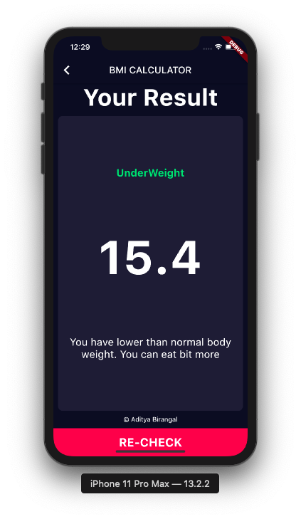

# BMI Calculator By Aditya Birangal

Avalible on Play Store
Install Now : <a href="https://play.google.com/store/apps/details?id=com.birangal.bmi_calculator
">Click Here</a>

## ScreenShots
<table style="width:100%">
  <tr>
    <th>Input</th>
    <th>Drawer</th>
    <th>About</th>
  </tr>
  <tr>
    <td></td>
    <td></td>
    <td></td>
  </tr>
</table>

<table style="width:100%">
  <tr>
    <th>UnderWeight</th>
    <th>Normal</th>
    <th>OverWeight</th>
    <th>Developer</th>
  </tr>
  <tr>
    <td></td>
    <td></td>
    <td></td>
    <td></td>
  </tr>
</table>

## Live Demo

## Details
This is Simple BMI Calculator

The BMI is a convenient rule of thumb used to broadly categorize a person as
1) Underweight
2) Normal weight
3) Overweight

Step :
- Select Gender
- Choose Height
- Set Weight
- Set Age
- Click on Calculate

Contact :
Aditya Birangal
developer@birangal.com

## Getting Started

This project is a starting point for a Flutter application.

A few resources to get you started if this is your first Flutter project:

- [Lab: Write your first Flutter app](https://flutter.dev/docs/get-started/codelab)
- [Cookbook: Useful Flutter samples](https://flutter.dev/docs/cookbook)

For help getting started with Flutter, view our
[online documentation](https://flutter.dev/docs), which offers tutorials,
samples, guidance on mobile development, and a full API reference.
